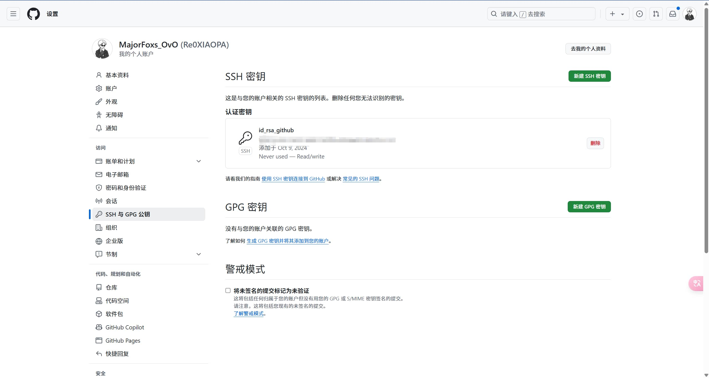
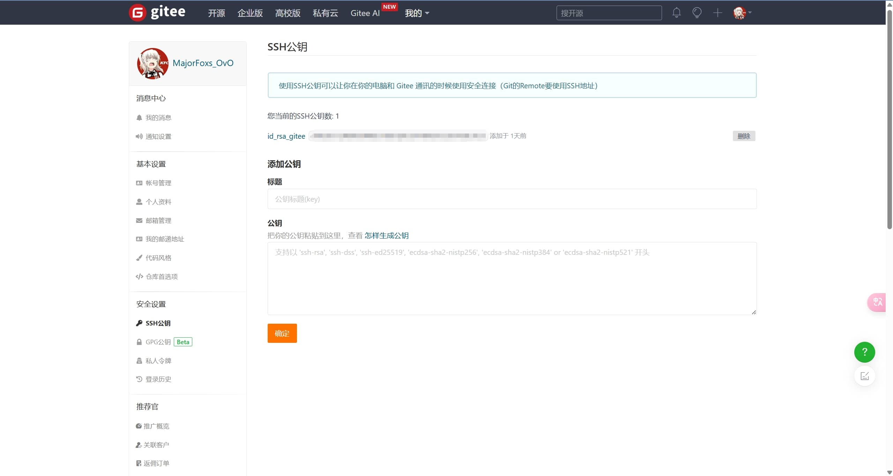

本篇笔记整理了 Git 的完整上手流程：安装、全局配置、常用命令、SSH 多平台密钥配置，以及把本地仓库上传到 Gitee / GitHub 的完整指南。内容源自我的学习笔记，结合实践整理成文。

## 一、Git 安装

1. 前往 [Git 官网](https://git-scm.com/) 下载对应系统的安装包
2. 安装时无脑下一步即可，**建议路径不要包含中文字符**
3. 安装完成后，桌面右键菜单会出现 **Git GUI**（图形界面）和 **Git Bash**（命令行）两个入口
   - **GUI**：用户界面模式
   - **Bash**：命令行模式（推荐）

## 二、Git 账户配置

> [!TIP]
> 若想同时配置 Gitee、Github、GitLab 等多个仓库平台，可暂时忽略此步，按第四节 SSH 方式配置。

```sh
# 配置账户名
git config --global user.name "你的名字"

# 配置账户邮箱
git config --global user.email "你的邮箱"
```

```sh
# 查看全局设置
git config --global -l

# 删除全局设置
git config --global --unset user.name
git config --global --unset user.email
```

## 三、Git 常用命令速查表

| 命令 | 备注 |
| --- | --- |
| `git init` | 初始化本地仓库 |
| `git add` | 添加改动的文件到暂存区 |
| `git status` | 查看仓库状态（未提交、已提交、未暂存、已暂存、未跟踪） |
| `git commit -m "提交信息"` | 提交更改 |
| `git push` | 将改动上传到远程仓库（未指定分支时使用 `git push origin master`） |
| `git pull` | 拉取远程仓库最新代码（指定分支：`git pull origin master`） |
| `git log` | 查看提交历史 |
| `git branch 分支名` | 创建分支 |
| `git checkout 分支名` | 切换分支 |
| `git merge 分支名` | 合并分支 |
| `git remote add origin 仓库地址` | 将本地仓库与远程仓库关联 |
| `git remote -v` | 查看关联的远程仓库 |
| `git remote rm origin` | 删除远程仓库关联 |
| `git clone 仓库地址` | 克隆远程仓库到本地 |
| `git -v` | 查看 Git 版本 |

### 强制推送说明

```sh
# 强制推送到远程仓库（会覆盖远程更改，影响其他协作者）
git push -u origin master --force

# 较为安全的强制推送
git push -u origin master --force-with-lease
```

如果你确定强制覆盖远程仓库之后不会出现问题，可以使用 `--force` 或 `--force-with-lease` 选项。**强制推送会覆盖远程仓库上的更改**，如果没有其他协作者，可自行判断是否使用。

## 四、配置 SSH 连接（Github + Gitee 双平台）

可同时分别配置 Github 和 Gitee 的 SSH 连接（也可以更多平台）。

### 1. 清除旧的全局配置

如果已经配置过 Git，需要先清除全局设置；如果没有配置过，跳过这一步。

```sh
# 查看是否存在用户名和邮箱
git config --global --list

# 删除用户名
git config --global --unset user.name

# 删除邮箱
git config --global --unset user.email
```

### 2. 生成 Github 的 SSH 密钥

1. 进入本地磁盘 `C:\User\你的用户名`，创建 `.ssh` 文件夹
2. 进入 `.ssh` 文件夹并**右键运行 Git Bash**
3. 生成密钥，邮件地址填写 Github 使用的邮箱：

```sh
ssh-keygen -t rsa -C "你的Github使用或注册的邮箱"
```

4. 设置 Github 的 ssh key 文件名为 `id_rsa_github`：

```
Enter file in which to save the key: id_rsa_github
```

> [!TIP]
> 密钥生成过程中 passphrase 可以直接回车跳过。

完成后会在 `~/.ssh` 目录下生成以下文件：

- `id_rsa_github`
- `id_rsa_github.pub`（公钥，需要添加到 Github）

### 3. 生成 Gitee 的 SSH 密钥

1. 同样在 `.ssh` 文件夹运行 Git Bash
2. Gitee 只认可 **ed25519** 类型的密钥，生成时必须指定该类型：

```sh
ssh-keygen -t ed25519 -C "你的Gitee使用或注册的邮箱"
```

3. 设置 Gitee 的 ssh key 文件名为 `id_rsa_gitee`：

```
Enter file in which to save the key: id_rsa_gitee
```

完成后会在 `~/.ssh` 目录下生成：

- `id_rsa_gitee`
- `id_rsa_gitee.pub`

### 4. 在 Github 和 Gitee 添加 SSH 密钥




- **Github**：头像 → Settings → SSH and GPG keys → New SSH key，粘贴 `id_rsa_github.pub` 内容
- **Gitee**：头像 → 设置 → SSH 公钥，粘贴 `id_rsa_gitee.pub` 内容

### 5. 创建 SSH config 配置文件

生成配置好密钥之后，还需在本地分别配置 Github 和 Gitee 的 SSH 连接：

1. 进入 `C:\User\你的用户名\.ssh` 文件夹
2. 创建一个 `config` 文件（可以用 `touch` 指令创建，也可以在新建文件时直接命名 `config.`）
3. 写入以下内容：

```bash
#github
Host github.com
HostName ssh.github.com
PreferredAuthentications publickey
Port 443
IdentityFile ~/.ssh/id_rsa_github

#gitee
Host gitee.com
HostName ssh.gitee.com
PreferredAuthentications publickey
Port 22
IdentityFile ~/.ssh/id_rsa_gitee
```

> [!WARNING]
> `id_rsa_github`、`id_rsa_gitee` 是生成密钥时起的文件名，注意大小写要与实际文件名一致。

### 6. 测试连接

```sh
# 测试 Github
ssh -T git@github.com

# 测试 Gitee
ssh -T git@gitee.com
```

如果出现账户名提示，则说明连接成功。

> [!TIP]
> 使用 SSH 方式后无需再配置用户名和邮箱；若在开发软件内提示配置用户名和邮箱，填写 Gitee 或者 GitHub 注册时的用户名和邮箱即可。

## 五、上传本地仓库到 Gitee / GitHub 完整流程

### 前提条件

- 已安装 Git
- 拥有 Gitee 和 GitHub 账号（并已在网页端创建好空仓库）

### 步骤 1：初始化本地仓库

在项目根目录下，打开终端或命令行，执行：

```sh
git init
```

### 步骤 2：添加文件并提交

```sh
git add .
git commit -m "Initial commit"
```

### 步骤 3：添加远程仓库

```sh
# 添加 Gitee 远程仓库（示例地址，替换为自己的仓库地址）
git remote add origin git@gitee.com:your_username/your_repository.git

# 添加 GitHub 远程仓库
git remote add origin git@github.com:your_username/your_repository.git
```

### 步骤 4：推送到远程仓库

```sh
git push -u origin master
```

> [!TIP]
> 若同时关联两个平台，可以使用不同的 remote 名称，例如 `gitee` 和 `github`，推送时分别执行 `git push -u gitee master`、`git push -u github master`。

### 日常提交流程总结

```sh
git init                                # 初始化本地仓库
git add .                               # 添加所有文件
git status                              # 查看状态
git commit -m "Your commit message"     # 提交更改
git remote add origin 仓库地址           # 添加远程仓库
git push -u origin master               # 推送到远程仓库
```
