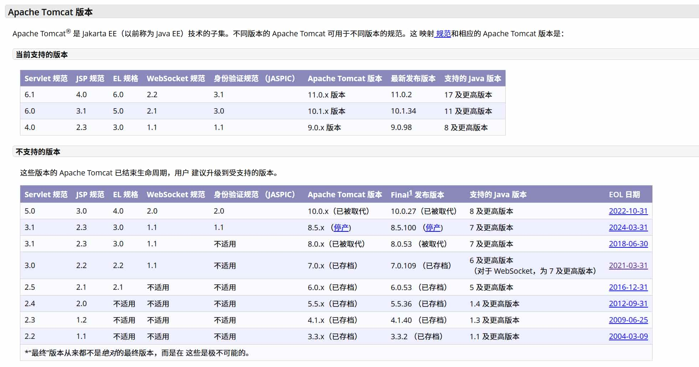

本篇整理了 JavaWeb 开发环境的核心组件 —— Apache Tomcat 的安装配置全过程，包含 JDK 版本对应表、环境变量配置，以及 Eclipse / IDEA 中集成 Tomcat 的方法。

## 一、下载 Tomcat

- Apache Tomcat 官方下载：[前往下载](https://tomcat.apache.org/)
  - 选择最新版本下载
  - Windows 系统选择：`apache-tomcat-[版本号].zip`
- 历史版本下载：[前往下载](https://archive.apache.org/dist/tomcat/)
  - 选择对应版本文件夹，如 `tomcat-9`
  - 进入 `v9.0.xx/bin` 目录下载对应系统的安装包

## 二、安装 Tomcat（Windows）

1. 将下载的 zip 文件解压到指定目录（**建议路径不要包含中文和空格**）
2. 进入 `[Tomcat目录]/bin` 文件夹
3. 双击 `startup.bat` 启动服务器
4. 打开浏览器访问 `http://localhost:8080` 验证安装

> [!TIP]
>  如果需要关闭 Tomcat，可以双击 `shutdown.bat`，不然可以手动关闭 Tomcat 进程，否则会一直占用端口 8080。

> [!WARNING]
> **如果启动失败，请检查 Tomcat 版本与 JDK 版本是否匹配**。

## 三、JDK 安装与配置

### 下载 JDK

- Oracle JDK 官方下载：[前往下载](https://www.oracle.com/java/technologies/downloads/)
- 国内下载（免登录）：[前往下载](https://www.java.com/zh-CN/download/)
- Open JDK 下载：[前往下载](https://jdk.java.net/)

### Tomcat 与 JDK 版本对应关系



| Tomcat 版本 | 最低 JDK | 最高 JDK | 推荐 JDK |
| --- | --- | --- | --- |
| **Tomcat 10.1.x** | JDK 11 | JDK 21 | **JDK 17**（推荐） |
| **Tomcat 10.0.x** | JDK 8 | JDK 20 | **JDK 11**（推荐） |
| **Tomcat 9.0.x** | JDK 8 | JDK 11 | **JDK 8/11**（推荐） |
| **Tomcat 8.5.x** | JDK 7 | JDK 11 | **JDK 8**（推荐） |
| **Tomcat 7.0.x** | JDK 6 | JDK 8 | **JDK 7**（推荐） |

> [!TIP]
>  如果是**新项目**，推荐使用 **Tomcat 10.1.x + JDK 17** 的组合。
> [!TIP]
> 如果是**维护项目**，建议使用 **Tomcat 9.0.x + JDK 8** 的组合。
> [!TIP]
> Tomcat 10.1.x 开始必须使用 JDK 11 或更高版本；使用高于推荐版本的 JDK 可能会出现兼容性问题！

### 配置环境变量（Windows）

1. **配置 `JAVA_HOME`**：右键「此电脑」→ 属性 → 高级系统设置 → 环境变量 → 新建系统变量：

```
JAVA_HOME = C:\Program Files\Java\jdk-版本号
```

2. **配置 Path**：在系统变量 `Path` 中添加：

```
%JAVA_HOME%\bin
%CATALINA_HOME%\bin
```

## 四、Eclipse + Tomcat 集成

### 下载安装

- 下载地址：https://www.eclipse.org/downloads/packages/
- 下载 **Eclipse IDE for Enterprise Java and Web Developers**（本文以最新版和 2020 版本为例）
- 压缩包版本解压到指定目录（如 `D:\eclipse`）

### 新建动态 Web 项目

1. 打开 Eclipse，选择 **File → New → Dynamic Web Project**，输入项目名称 Project name（如 `myWeb`）
2. Target Runtime 选择 **New Runtime...** 添加 Apache Tomcat 版本（与你安装的版本一致），点击 Next
3. 构建页无需更改，继续点击 Next
4. Web Module 页面**勾选 `Generate web.xml deployment descriptor`**，点击 Finish
5. 展开项目：**新版本**在 `src\main\webapp` 下新建 JSP 文件，**旧版本**在 `WebContent` 下新建 JSP 文件
6. JSP 模板文件选择 HTML5，没有就选 HTML

### Java Resources 新建 Servlet

- **新版本**：在 Java Resources 下的 `src/main/java` 右键选择 **New → Servlet**，输入 Java package 名、Class name 名，一直下一步到 Finish
- **旧版本**：在 Java Resources 下的 `src` 右键选择 **New → Servlet**，操作同上

> 例如 `src/com/example/MyServlet.java`：表示在源代码目录（src）下有一个名为 `com` 的包，包下有 `example` 子包，`example` 包下有 `MyServlet.java` 文件。Servlet 是 Java EE 规范的一部分，用于处理客户端请求并生成响应。

### 运行访问

- 右键项目选择 **Run As → Run on Server**，选择 Tomcat 服务器，点击 Finish

> [!WARNING]
> 当选择 Tomcat 服务器时，如果在现有的服务器上运行失败，可以选择手工定义一个新服务器，选择对应的版本重新运行。

### 常见问题

| 问题 | 解决方案 |
| --- | --- |
| JSP 文件无法在服务器上运行 | [概率性问题] 创建文件时没有勾选 `Generate web.xml deployment descriptor` |
| Tomcat 服务器端口占用 | 重启 Tomcat 服务，释放 8005、8009、8080 端口，或双击服务器修改端口 |
| 动态 Web 页面原样输出 | 在 `protected void doGet` 方法下添加 `response.setContentType("text/html;charset=UTF-8");`，或检查项目 / Tomcat 编码是否设置为 UTF-8 |

## 五、IDEA + Tomcat 配置

IntelliJ IDEA 2024 配置 Java Web 的视频教程（B 站）：

- [#01] IDEA 2024 配置 Java Web（IDEA 下载及配置 Tomcat 服务器）：[点击观看](https://www.bilibili.com/video/BV1WT42197kb)
- [#02] IDEA 2024 配置 Java Web：[点击观看](https://www.bilibili.com/video/BV1kz421U7Np)

> [!WARNING]
> 如果视频无法播放，可复制 BV 号在 B 站搜索观看。
