欢迎来到本篇教程！本文面向所有想要加入 **方块酒馆（BlockTavern）** 服务器的新玩家，从零开始讲解启动器安装、整合包导入、账号设置、进服注册登录的完整流程，并附带官方文档截图，跟着做就能顺利进服游玩（部分图片可能过时，但整体教程无误）。

- 官方下载站：[https://www.blocktavern.cn/](https://www.blocktavern.cn/)
- 官方文档中心：[https://docs.blocktavern.cn/](https://docs.blocktavern.cn/)

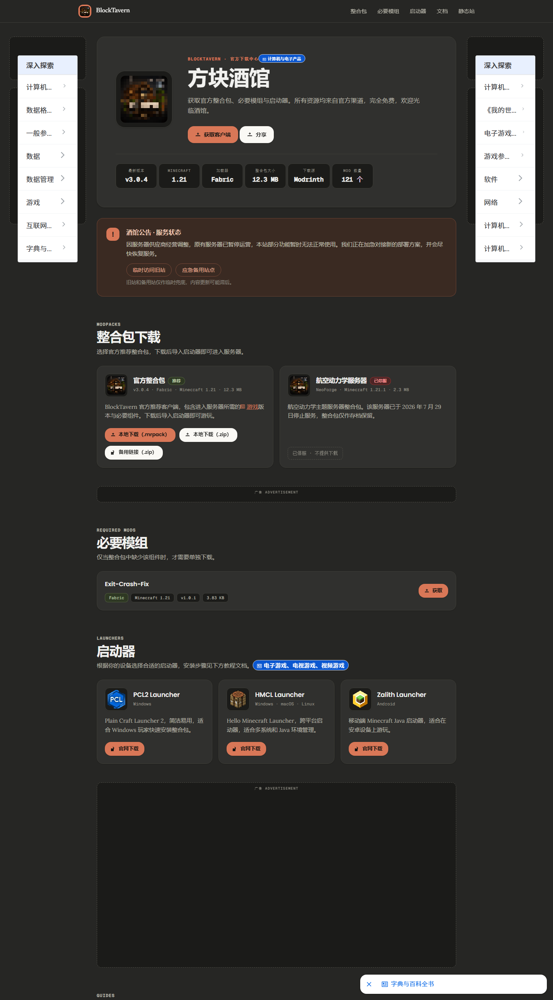

> [!WARNING]
> 服务器必须使用**官方配套整合包**，私自增减模组会导致无法进入服务器、游戏崩溃、物品异常！

> [!NOTE]
>  **服务状态说明**：因服务器供应商经营调整，原有服务器目前暂停运营，官网部分功能暂时无法正常使用，团队正在加急对接新的部署方案。恢复运营后，按照本教程即可直接进服。旧站内容仅作临时兜底，请认准官方渠道 `blocktavern.cn`，谨防假冒网站。

## 一、游玩前置要求

1. **操作系统**：推荐 Windows 10 / Windows 11；其他系统可使用跨平台启动器（见下文）
2. **内存**：最低 4GB，建议分配 8GB 内存游玩
3. **文件路径**：游戏、启动器存放文件夹**严禁包含中文、空格**
   - 正确示例：`D:\MC\BlockTavern`
   - 错误示例：`D:\游戏\方块酒馆`
4. **Java 环境**：需要 **Java 17 或更高版本**（多数启动器可一键自动安装）

## 二、下载官方整合包

方块酒馆官方推荐客户端为 **官方整合包 v3.0.4**，包含进入服务器所需的全部组件（游戏版本、Fabric 加载器、121 个模组），大小仅约 12.3 MB，完全免费。

打开官网 [www.blocktavern.cn](https://www.blocktavern.cn/)，在 **「整合包下载」** 区域选择官方整合包：

| 项目 | 说明 |
| --- | --- |
| 版本 | v3.0.4 · Fabric · Minecraft 1.21（Java 版） |
| 模组数量 | 121 个（生电优化向） |
| 文件格式 | `.mrpack`（Modrinth 格式）/ `.zip` |
| 下载方式 | 官网「本地下载」或「备用链接」（蓝奏云） |

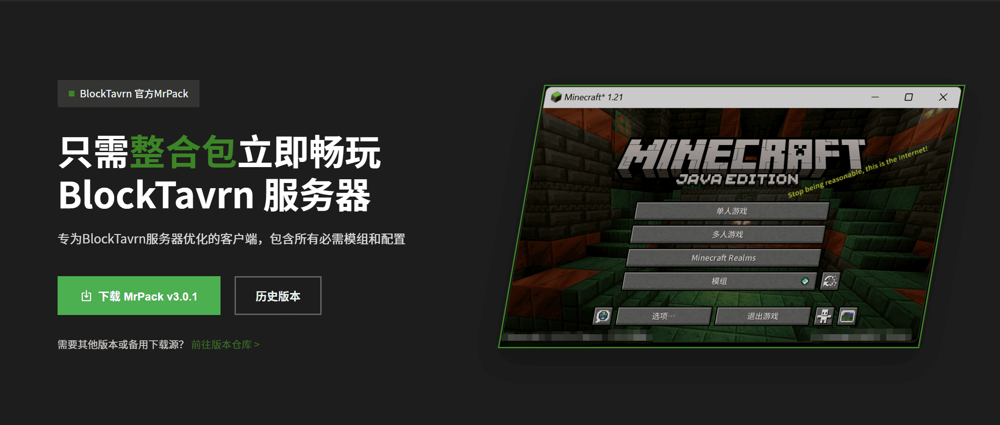

下载完成后，你将得到一个整合包安装文件（`.mrpack` 或 `.zip`）：

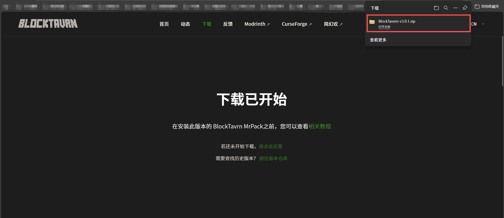

> [!TIP] 三种下载方式任选其一
> - **本地下载（.mrpack）**：官方推荐，PCL2 / HMCL 均可直接导入
> - **本地下载（.zip）**：兼容性更好，备用
> - **备用链接（.zip）**：蓝奏云网盘，可扫码或点击下载


> [!WARNING]
> **不要手动解压整合包！** 直接让启动器导入压缩包即可。

> [!NOTE] 另有「航空动力学服务器」整合包（NeoForge · MC 1.21.1），该服务器已于 2026 年 7 月 29 日停止服务，整合包仅作存档保留，新玩家请下载官方整合包。

## 三、安装游戏启动器

启动器是管理游戏版本、账号和模组的工具。官方提供三款启动器，任选其一即可，新手推荐 **PCL2**。

[grid]


[/grid]

| 启动器 | 适用平台 | 下载地址 |
| --- | --- | --- |
| **PCL2**（推荐） | Windows | https://afdian.com/p/0164034c016c11ebafcb52540025c377 |
| **HMCL** | Windows / macOS / Linux | https://hmcl.huangyuhui.net/ |
| **Zalith** | Android（安卓） | https://zalithlauncher.cn/ |

> [!TIP]
> 官方教程同时提供 Modrinth App 与微软官方启动器选项，但**不推荐官方启动器**（Modrinth 需正版登录、官方启动器整合包导入麻烦）。

## 四、导入整合包并启动游戏

### 方案一：PCL2（推荐）

1. 将下载的 PCL2 压缩包解压到纯英文路径（如 `D:\MC\PCL`），运行 `PCL.exe`
2. 首次打开启动器会自动检测 Java；若缺少运行环境，可一键自动安装 Java 17
3. 切换到 **【版本】** 页面 → 左下角 **【导入整合包】**，选中下载好的整合包文件（`.mrpack` 或 `.zip`）
4. 确认导入，等待启动器自动下载游戏本体、Fabric 加载器与全部模组（首次需要一些时间）
5. 版本列表出现 `BlockTavern` 相关版本即代表导入成功

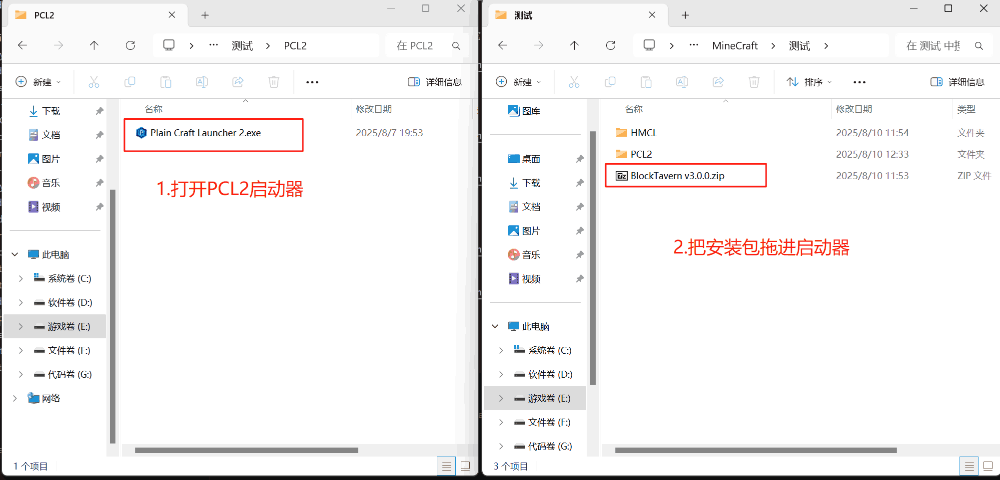
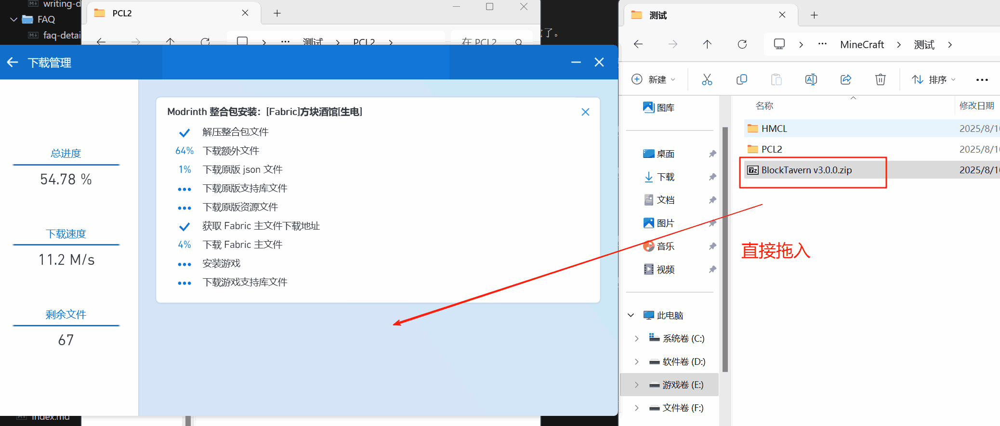
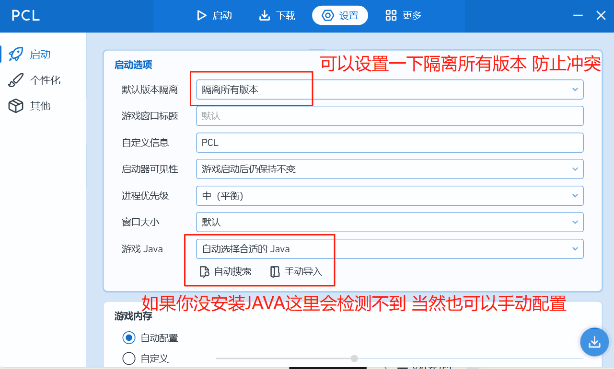
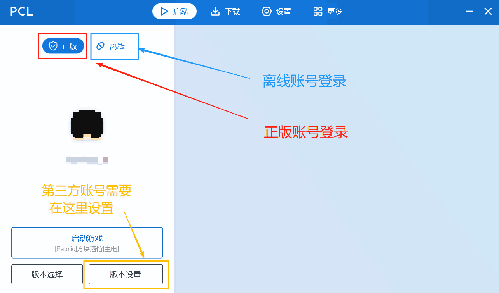
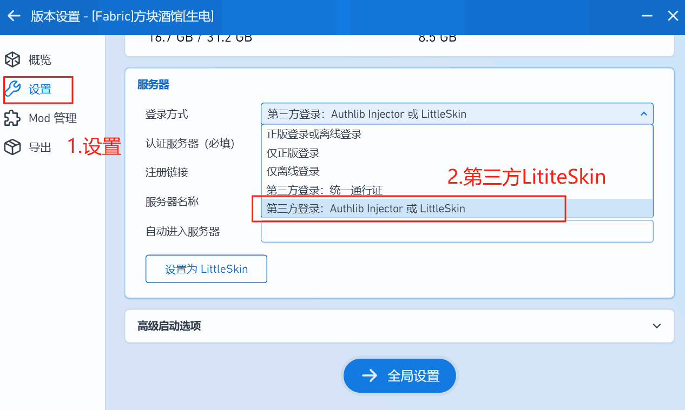
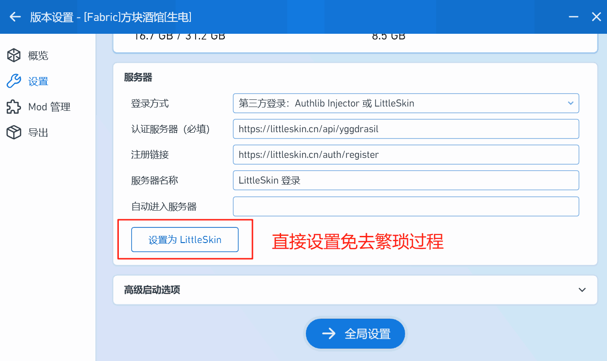
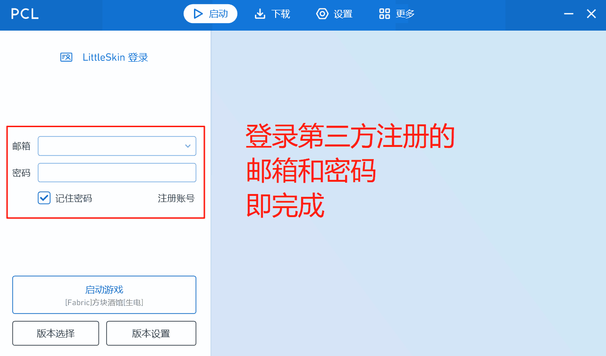

### 方案二：HMCL（跨平台）

1. 解压并运行 HMCL 主程序
2. 直接将整合包压缩包**拖拽进 HMCL 窗口**，或通过「版本列表 → 安装整合包」导入
3. 若无 Java 环境，按提示手动配置 Java 17
4. 等待自动下载完成后，版本列表出现对应版本即可启动

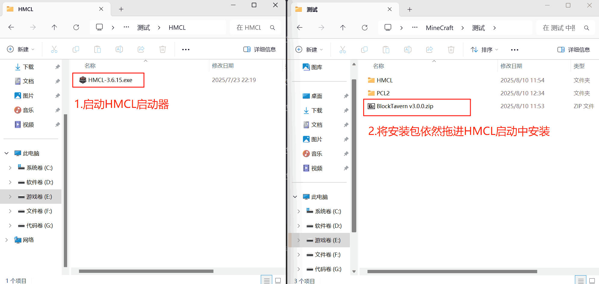
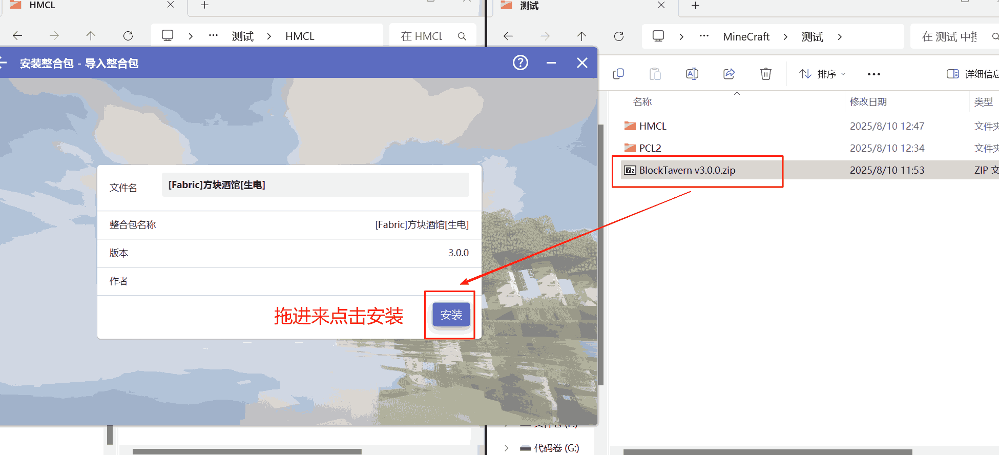
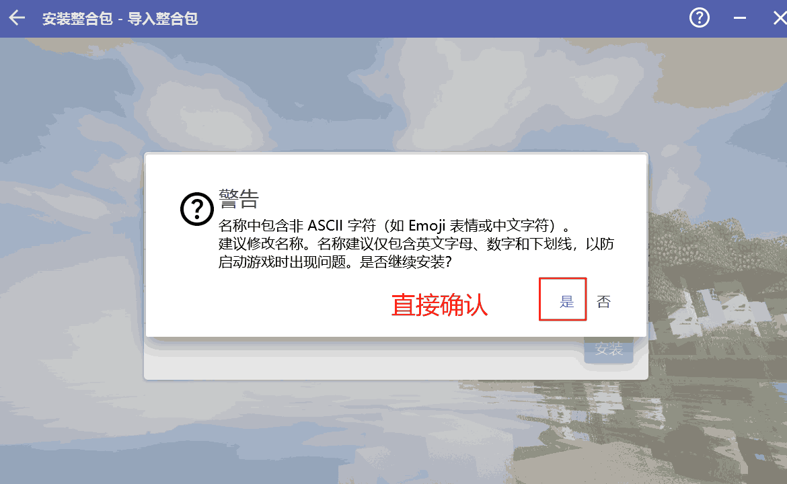
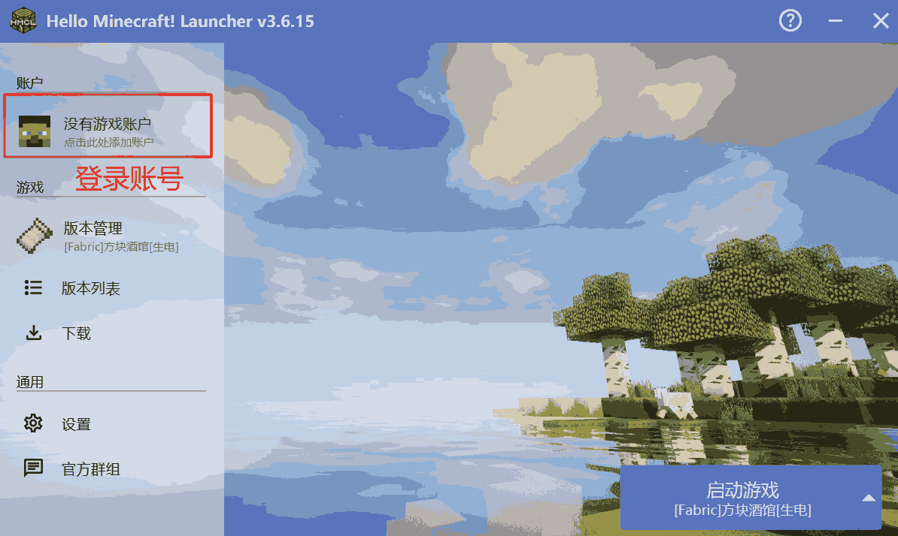
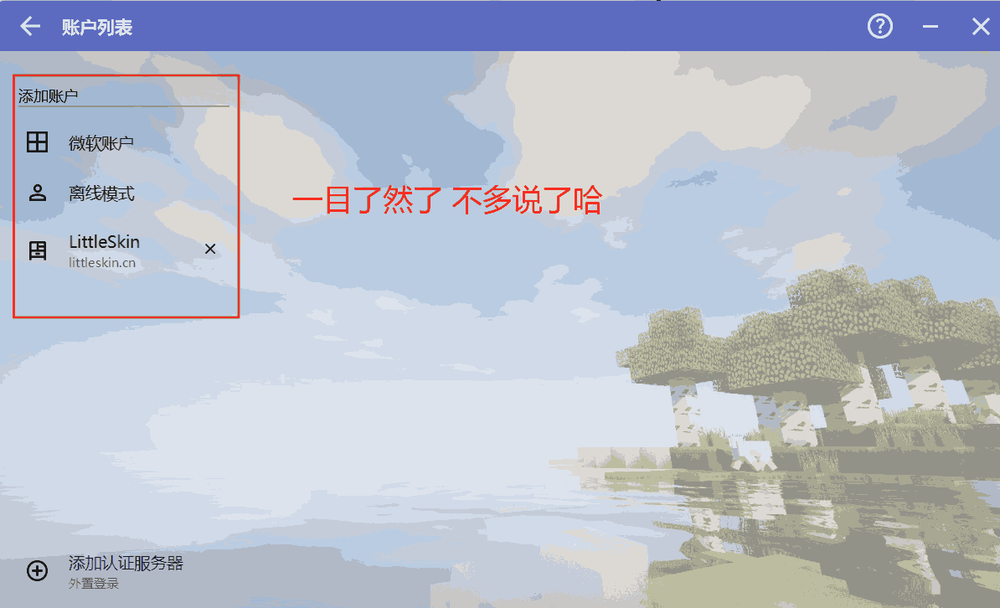

### 方案三：Zalith（安卓）

1. 官网下载并安装 Zalith Launcher
2. 将整合包文件传入手机，在启动器中选择「导入整合包」
3. 按提示配置 Java 环境（手机端建议预留 4GB 以上可用内存）

## 五、账号设置与启动

启动器提供三种登录方式，按需选择：

- **第三方皮肤站登录**：前往 [LittleSkin](https://littleskin.cn/) 注册账号，可自定义游戏皮肤，注册完成后返回启动器登录
- **离线登录（大部分玩家）**：填写英文 ID（仅字母、数字，不能中文），该 ID 就是游戏内名称
- **微软正版登录**：选择微软登录，浏览器授权账号，自动加载正版皮肤

选择整合包版本，点击 **启动游戏**，等待游戏加载完成即可。

> [!TIP]
>  内存分配建议：启动器设置中将游戏内存（JVM 参数）调整为 **3072MB 以上**，推荐 4096–8192MB，可显著减少卡顿与崩溃。

## 六、进入服务器 & 账号注册

1. 游戏主菜单 → **多人游戏** → 添加服务器
2. 服务器信息填写
   - 名称：方块酒馆（可自定义）
   - 地址：`mc.blocktavern.cn`

> [!TIP]
> 官方整合包**已内置服务器地址**，多人游戏列表里可直接双击进入，无需手动输入。若地址失效，可进官方社群咨询最新 IP。

3. 保存服务器，双击进入
4. **首次进入需要注册账号**，在聊天框输入指令：

```
/register 你的密码 重复密码
```

示例：`/register 666888 666888`

5. 之后每次登录服务器输入：

```
/login 你的密码
```

> [!NOTE]
>  忘记密码请查阅官方文档 FAQ 寻求解决方案。

## 七、服务器常用指令

> 更多指令详见官方文档指令列表：[https://docs.blocktavern.cn/GameplayGuide/command-list/](https://docs.blocktavern.cn/GameplayGuide/command-list/)

### 传送类

| 指令 | 功能 |
| --- | --- |
| `/warp` | 查看服务器公共地标 |
| `/warp <地标名>` | 传送到指定公共地标 |
| `/spawn` | 返回出生点 |
| `/back` | 返回上一次传送前的位置 |
| `/tpa <玩家名>` | 请求传送到其他玩家 |
| `/tpaccept` | 接受传送请求 |
| `/tpadeny` | 拒绝传送请求 |
| `/sethome <名称>` | 设置当前位置为家 |
| `/home <名称>` | 传送到指定家 |
| `/delhome <名称>` | 删除指定家 |
| `/homelist` | 查看所有已设置的家 |

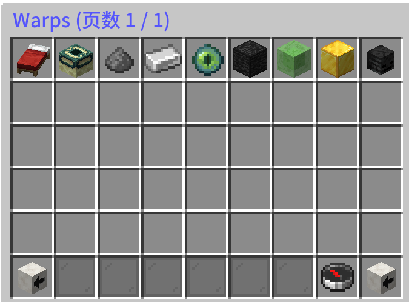

[grid]
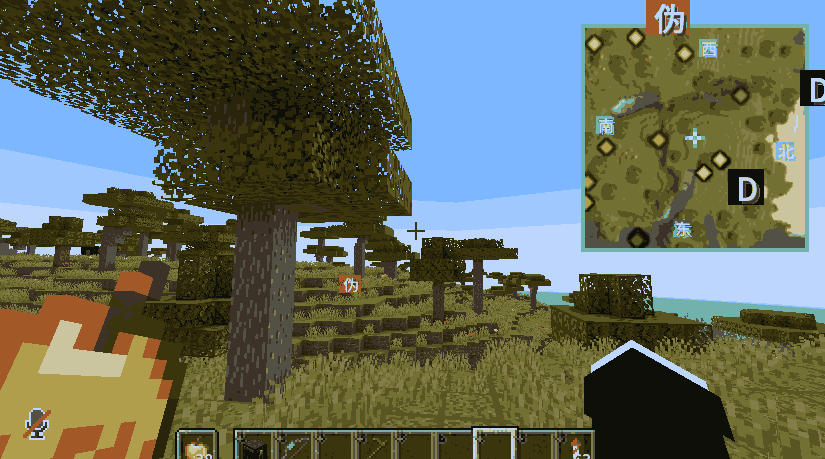
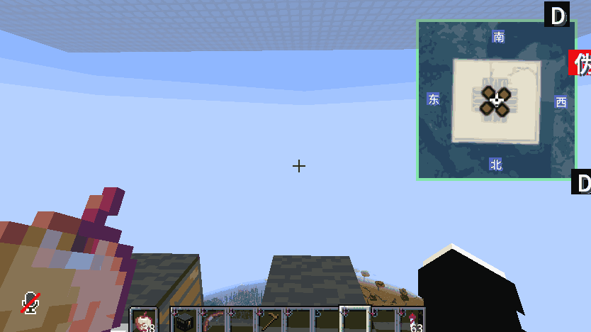
[/grid]

[grid]


[/grid]

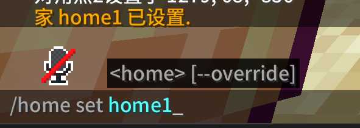
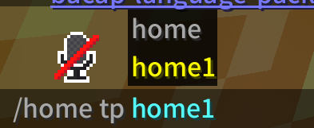
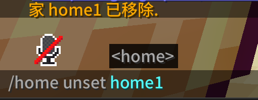
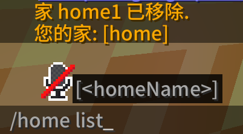

### 社交与其他

| 指令 | 功能 |
| --- | --- |
| `/msg <玩家名> <消息>` | 私聊玩家 |
| `/r <消息>` | 回复私聊 |
| `/rules` | 查看服务器规则 |
| `/help` | 查看帮助 |

> [!WARNING]
> 进服前务必阅读服务器规则（[/rules 或官方文档](https://docs.blocktavern.cn/GameplayGuide/server-rules/)），违规将会受到警告、禁言乃至封禁处罚！

## 八、圈地与假人

### 圈地（Enclosure 领地系统）

服务器加入 **Enclosure** 领地系统，使用**木锄头**选择对角点即可创建保护罩，防止其他玩家破坏。

1. 手持**木锄**，左键选择第一个对角点
2. 右键选择第二个对角点
3. 输入指令创建领地

| 指令 | 功能 |
| --- | --- |
| `/enclosure help` | 查看所有领地指令 |
| `/enclosure create <名称>` | 创建领地 |
| `/enclosure tp <名称>` | 传送到指定领地 |
| `/enclosure list` | 查看已创建的领地 |
| `/enclosure set` | 设置领地属性 |
| `/enclosure gui` | 打开领地管理界面 |
| `/enclosure info` | 查看当前领地详细信息 |
| `/enclosure remove <名称>` | 删除领地 |

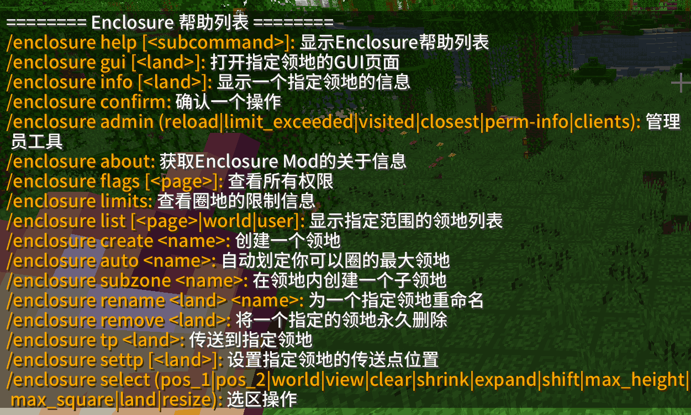
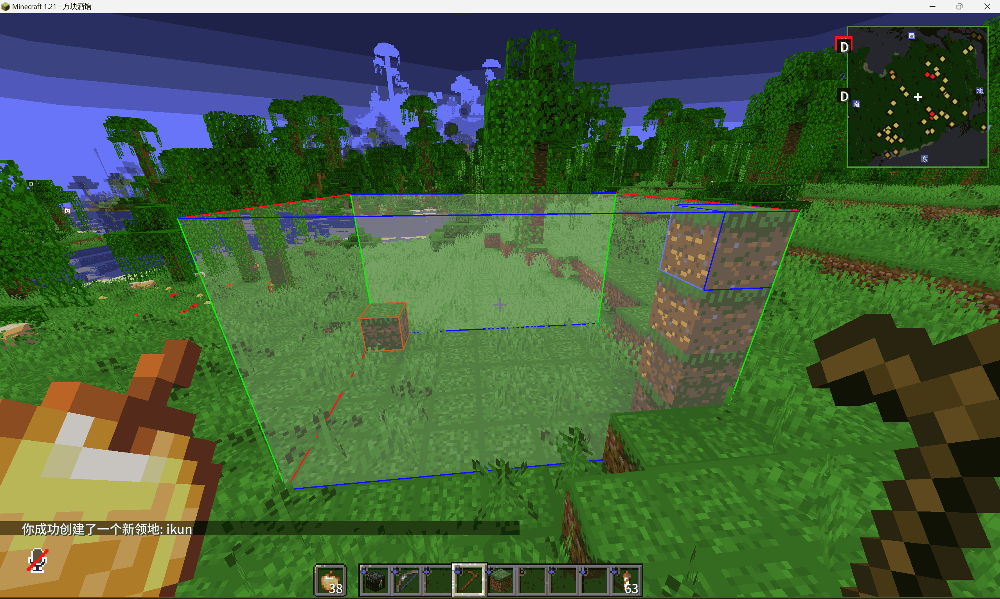
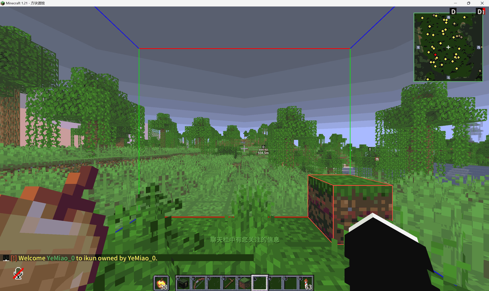

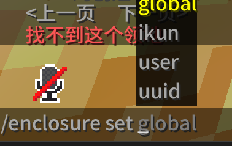
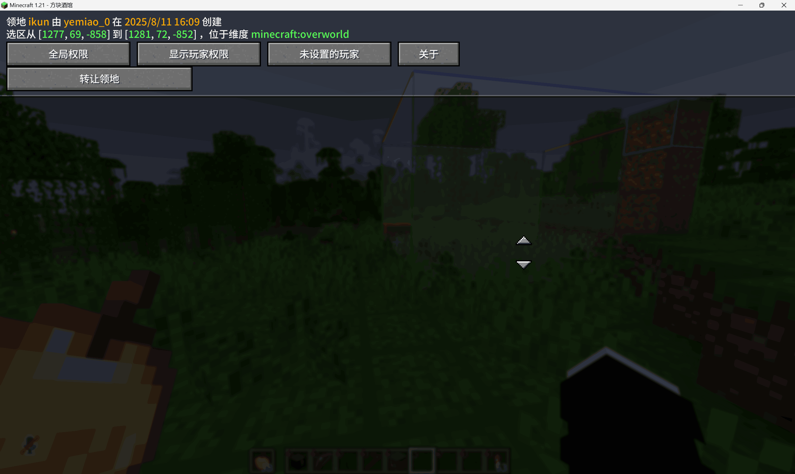


> [!WARNING]
>  若领地 GUI 无法显示，需要下载 Enclosure 模组（`[领地]enclosure-fabric-0.4.5+1.21.jar`）放入 mods 文件夹并重启游戏。

### 假人指令

服务器支持生成假人玩家，可用于挂机、测试红石机器等场景。

| 指令 | 功能 |
| --- | --- |
| `/player <名称> spawn` | 生成一个假人 |
| `/player <名称> kill` | 删除指定假人 |

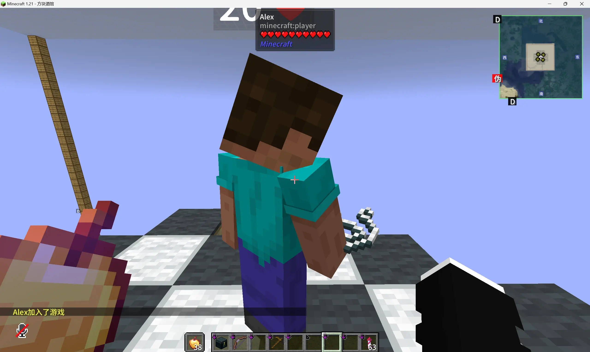
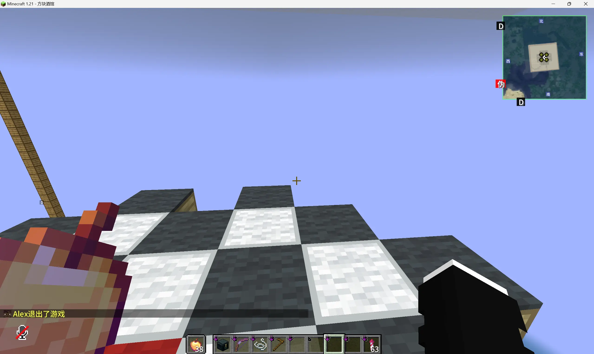

> [!WARNING]
> 假人会占用服务器资源，不要生成过多；假人断开连接后会自动消失，也不要利用假人进行作弊行为。

## 九、常见问题排查

### 1. 无法验证身份服务器

**报错**：登录失败：暂时无法连接到身份验证服务器，请稍后再试

**解决**：使用 **UsbEAm Hosts Editor** 修复（下载后参考 B 站视频教程修改 Hosts 文件）。

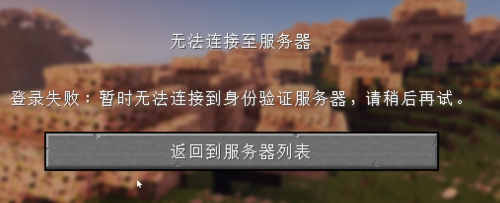

### 2. 退出游戏崩溃

Minecraft 1.21 版本存在注册表问题，部分玩家退出游戏时会崩溃，属已知问题。官方提供 **Exit-Crash-Fix 修复模组**（v1.0.1），在官网「必要模组」区域下载后放入 mods 文件夹即可正常退出。

> 若整合包已内置该模组则无需重复安装。

### 3. 游戏崩溃、黑屏

- 检查文件夹路径是否存在中文
- 在启动器设置中重新安装 Java 17
- 适当调高游戏分配内存（建议 3072MB 以上）
- 可在官方社群下载修复模组缓解崩溃；遇到崩溃尽量提交问题，方便维护人员修复

### 4. 无法连接服务器

- 确认使用的是官方完整整合包（服务器地址已内置）
- 检查自身网络是否卡顿、是否开启了 VPN 等代理工具
- 关闭电脑防火墙尝试，或切换手机热点测试
- 若自身网络无问题，建议联系服务器管理员

### 5. 提示模组缺失

请勿自行修改模组！重新下载官方整合包覆盖安装即可。

## 十、相关资源

| 资源 | 地址 |
| --- | --- |
| 官方下载站 | https://www.blocktavern.cn/ |
| 官方文档中心 | https://docs.blocktavern.cn/ |
| 静态站（数据更新有延迟） | https://new.blocktavern.cn/ |
| 临时旧站 / 应急备用站 | https://old.blocktavern.cn/ / https://bak.blocktavern.cn/ |
| 服务器规则 | https://docs.blocktavern.cn/GameplayGuide/server-rules/ |
| 指令列表 | https://docs.blocktavern.cn/GameplayGuide/command-list/ |
| FAQ 常见问题 | https://docs.blocktavern.cn/FAQ/faq-details/ |

## 写在最后

按照上面的步骤操作，你就可以顺利进入方块酒馆开启生存冒险。方块酒馆是一个**可生电、高性能、无限制**的生存养老服，欢迎每一位玩家的加入！

教程无法覆盖所有突发问题，遇到疑难问题优先查阅官方文档，也可以前往官方社群咨询管理与其他玩家。祝各位游玩愉快！
